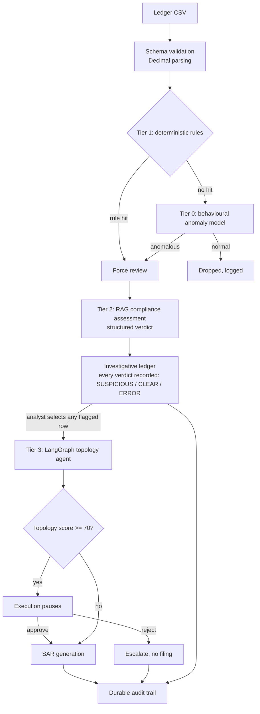

# Fintech Fraud Auditor

A tiered anti-money-laundering screening prototype. Cheap deterministic checks and
a behavioural anomaly model reduce a transaction ledger to the rows worth
spending an LLM call on, then a retrieval-grounded compliance tier and a stateful
graph agent assess what survives.

## The design decision that matters

The obvious way to build a cost funnel is to put the cheapest filter first and
drop everything it considers normal. That is what the first version of this
project did, and it was wrong in a way worth describing, because the same mistake
is easy to make in any tiered system.

An `IsolationForest` fitted on transaction amount discards anything whose amount
is statistically ordinary. Structuring — splitting a large sum into legs just
under the reporting threshold — is *defined* by amounts that look ordinary. The
optimisation designed to save money was deleting the fraud the later tiers
existed to catch, and a `$500` transfer from a sanctioned jurisdiction never
reached the country check because it had already been dropped on amount alone.

The fix is ordering, not tuning. Deterministic compliance rules run **before**
the statistical funnel and set a force-review flag the funnel is not permitted to
override. Cost optimisation never outranks a compliance rule.

Measured on `data/sample_ledger_labelled.csv` (465 rows, 45 labelled laundering
transactions across six typologies), via `python scripts/evaluate.py`. That
file is gitignored (generated, not checked in); run
`python scripts/generate_sample_ledger.py` first to reproduce it - the
generator uses a fixed seed, so a fresh clone gets byte-identical data and
these exact numbers:

| Pipeline | Recall | Precision | F1 | Forwarded to LLM |
|---|---|---|---|---|
| Original ordering | 7% | 33% | 0.11 | 9 rows (2%) |
| Current ordering | 84% | 79% | 0.82 | 48 rows (10%) |

Per typology:

| Pattern | Rows | Recall (current) | Recall (original) | Caught by |
|---|---|---|---|---|
| structuring | 10 | 100% | 0% | Tier 1 rule (structuring band) |
| sanctioned | 6 | 100% | 0% | Tier 1 rule (high-risk jurisdiction) |
| fan_in | 11 | 100% | 0% | Tier 0 (ML funnel) - no rule reaches it |
| circular | 3 | 100% | 100% | Tier 1 rule (amount ≥ $10,000) |
| circular_small | 7 | 100% | 0% | Tier 0 (ML funnel) - but see the caveat below |
| circular_camouflaged | 8 | 12% (1/8) | 0% | Coincidence, not detection - see below |

`scripts/evaluate.py` prints this same breakdown for both pipelines side by
side, so it's reproducible from the same command as the summary table above.

CI gates on this ledger
(`python scripts/evaluate.py --min-recall 1.0 --min-pattern-recall 1.0 --gate-exclude circular_camouflaged`,
enforced in `.github/workflows/ci.yml`) and fails the build if recall on any
*gated* typology drops below 100%. `circular_camouflaged` is deliberately
excluded from that gate via `--gate-exclude` - not because it doesn't matter,
but because failing CI on a known gap nothing has fixed yet just trains people
to ignore red builds. It is still printed in every report, uncensored, so the
gap stays visible instead of disappearing into a passing build. Separately,
**pytest and the eval gate catch different regressions** - pytest's rule
tests fail when a compliance rule breaks even if the ML tier compensates for
it, and the eval gate fails when the ML tier degrades even if every rule test
still passes; each alone has a blind spot the other one covers.

**`circular_small` is caught because its accounts are new, not because of
cycle detection.** Its rows are one-off accounts (`Loop0-0`, `Loop1-2`, ...)
that transact exactly once each in the whole batch; Tier 0 flags them for
looking unlike the repeat-business background on transaction-count and volume
features, not because any feature encodes "this is a cycle." A launderer
routing the same amounts through accounts that already have ordinary history
would not trip this.

**`circular_camouflaged` tests exactly that, and mostly gets through.** Same
ring shape, built from businesses that already appear throughout the "clean"
background with normal repeat activity, at that same amount distribution,
spread over roughly ten days. The pipeline forwards 1 of 8 rows, and only by
coincidence: its random amount ($9,210.86) landed in the structuring band, so a
Tier 1 rule caught it, not the ring. The other seven blend in completely and
are missed. See Known limitations.

What each column in the summary table means, in plain terms:

- **Recall** - of the 45 rows actually labelled laundering, the percentage the
  pipeline forwarded to a human/LLM instead of silently dropping. This is the
  number that matters most here: a missed row is never looked at again.
- **Precision** - 79% means about 4 of every 5 forwarded rows are real
  laundering; the rest are false alarms an analyst has to clear.
- **F1** - the harmonic mean of recall and precision, a single number for
  comparing the two pipelines when both figures moved. It is not independently
  meaningful; read recall and precision first.
- **Forwarded to LLM** - the row count and share of the 465-row batch that
  reached Tier 2 (the compliance LLM tier is the expensive step this whole
  funnel exists to gate). Higher recall costs more forwarded rows.

**Caveat: this is not an independent benchmark.** The same person who wrote
`utils/features.py` (what the funnel looks for) also wrote
`scripts/generate_sample_ledger.py` (the patterns injected into the labelled
data) and `utils/rules.py` (the thresholds). A 100% recall on a gated typology
shows the funnel catches the failure modes it was explicitly built to catch on
data shaped by the same assumptions - it is evidence the fix works as
designed, not evidence it generalises to laundering patterns nobody
anticipated, adversarial ledgers, or a real production distribution.
`circular_camouflaged`'s 12% is the concrete demonstration of that limit: the
same author built both sides, and the pipeline still misses it. Treat the
gated numbers as a regression guard against reintroducing the original bug,
not as a claim about real-world detection rates.

## Architecture



Tier 3 is not automatically gated on the Tier 2 verdict: every assessed row, whatever
its verdict, lands in the investigative ledger, and the analyst manually picks any
one of them to run the topology agent — a CLEAR-verdicted row can still be sent
through it.

**Tier 1, deterministic rules** (`utils/rules.py`). Reporting threshold, the
structuring band below it, high-risk and secrecy jurisdictions, sanctions
screening (RapidFuzz fuzzy name match, flags at 88% similarity or above), and
unidentified counterparties. Runs first; a hit is binding.

**Tier 0, behavioural funnel** (`utils/funnel.py`, `utils/features.py`). Twelve
features describing how an account behaves across the batch — per-sender
velocity, transactions in the structuring band, counterparty fan-out and fan-in,
round-number ratio, corridor rarity — rather than the amount alone. The flag
threshold is a robust z-score against the batch's own median and MAD, so a clean
batch flags nothing. `contamination` is deliberately unused: it is a fixed quota
that flags 15% of a clean batch and drops 85% of a fraudulent one.

**Tier 2, compliance assessment** (`utils/agents.py`). Retrieval-grounded
analysis followed by an independent structured review. Verdicts come back through
a constrained schema, never by keyword-matching prose. The chat model is a
config switch (`utils/llm_provider.py`), not a rewrite: **Claude Haiku 4.5 on
Amazon Bedrock** by default, or **Gemini 2.5 Flash on Google Vertex AI** with
`MODEL_PROVIDER=vertex`. Both must support tool calling, because the verdict
comes back through `with_structured_output`.

**Tier 3, topology** (`utils/graph_nodes.py`, `utils/graph_logic.py`). Circular
flows, account velocity, and beneficiary obfuscation. Scoring is per unique
counterparty and capped, so the result reflects network shape rather than how
many rows were uploaded.

**Human review.** A topology score of 70 or above (out of 100) pauses execution
via LangGraph's `interrupt_before`. Approval records the officer, timestamp,
decision, and note; rejection routes to escalation and produces no filing.

## Requirements

Verified against **Python 3.14.4** on **Windows 11 (build 10.0.26200)**. On this
version, `SQLAlchemy` (a `langchain-community` dependency) has no prebuilt wheel
yet, so pip builds it from source on install; that needs no action from you, but
it does mean the first install is slower and briefly pulls build tooling.

## Setup

1. Clone the repo:

   ```bash
   git clone https://github.com/vinaykumar101997/Fintech-Fraud-Agent-Pro.git
   cd Fintech-Fraud-Agent-Pro
   ```

2. Create and activate a virtualenv:

   ```bash
   python -m venv .venv && source .venv/bin/activate   # Windows: .venv\Scripts\activate
   ```

3. Install dependencies:

   ```bash
   pip install -r requirements.txt
   ```

   `requirements.txt` pins ranges wide enough to resolve (the tightly-coupled
   `langchain`/`langgraph` cluster in particular needs room to find mutually
   compatible versions). `requirements.lock.txt` is `pip freeze` output from a
   known-working install and reproduces that exact set:

   ```bash
   pip install -r requirements.lock.txt
   ```

   Only running the offline test/eval path (no Streamlit app, no LLM tier)?
   `requirements-dev.txt` installs the much smaller set that needs - see
   Commands below.

4. Configure the environment:

   ```bash
   cp .env.example .env       # then edit it
   ```

   Authentication depends on `MODEL_PROVIDER`, and the two are not
   interchangeable:

   - **`bedrock` (default, AWS).** Credentials come from the standard boto3
     chain, not from gcloud: `aws configure sso` (recommended) or `aws configure`
     locally, or an IAM role with no action needed in production (EC2 instance
     profile, ECS task role, App Runner instance role). Full walkthrough,
     including the Bedrock model-access step every account needs once, in
     `SETUP_AWS.md`.
   - **`vertex` (GCP).** Authentication uses Application Default Credentials:
     run `gcloud auth application-default login` locally, or Workload Identity
     in production. Full walkthrough in `SETUP.md`.

   Neither path needs a service-account key or an access key committed to the
   project root — see `.dockerignore` and `scripts/preflight.py`, which checks
   for exactly that.

5. Generate the sample ledger and run the app:

   ```bash
   python scripts/generate_sample_ledger.py
   streamlit run app.py
   ```

   The app runs without the LLM backends: rules and the funnel still execute,
   and the UI says so rather than presenting a blank result.

6. Optional: index the regulatory corpus before using the compliance tier:

   ```bash
   python scripts/ingest_pdf.py --file data/aml_guidelines.pdf
   ```

## Commands

Tests and the funnel evaluation touch only `utils/rules.py`, `utils/funnel.py`,
`utils/features.py`, `utils/data_loader.py`, `utils/graph_nodes.py`,
`utils/screening.py`, `utils/sanitize.py`, `utils/verdicts.py`, and
`utils/audit_log.py` - none of which import the LLM/vector-store stack, so
`pip install -r requirements-dev.txt` is enough to run everything below
without `requirements.txt`. This is what `.github/workflows/ci.yml` installs.

```bash
pytest tests/ -v                        # 41 offline regression tests, no network

# data/sample_ledger*.csv are gitignored (generated, not checked in) - build
# them before evaluating. generate_sample_ledger.py uses a fixed seed (7), so
# this is deterministic: a fresh clone reproduces the labelled ledger byte-for-
# byte, which is what the recall/precision/F1 numbers above were measured on.
python scripts/generate_sample_ledger.py
python scripts/evaluate.py              # per-typology recall and precision
python scripts/evaluate.py --with-llm   # include the live compliance tier

# what CI actually runs: fails the build below 100% recall on any typology
# except circular_camouflaged, a known gap tracked in Known limitations
python scripts/evaluate.py --min-recall 1.0 --min-pattern-recall 1.0 \
    --gate-exclude circular_camouflaged

python scripts/check_json.py --file data/transactions.json
python -m utils.chat_agent              # interactive corpus query
```

## What was fixed

| Area | Issue | Resolution |
|---|---|---|
| Funnel order | ML filter ran before compliance rules and discarded structuring | Rules first, with a binding force-review flag |
| Features | `IsolationForest` fitted on amount alone | Twelve behavioural features (`utils/features.py`) |
| Threshold | `contamination=0.15` flagged a fixed 15% regardless of data | Robust MAD z-score with a rate ceiling |
| Error handling | Exceptions returned a string that keyword-matched to CLEAR | `Verdict.ERROR`, never treated as cleared |
| Verdicts | Substring search matched "no indication of money laundering" | Constrained Pydantic schema |
| Risk score | `+50` per matching row, no dedup or cap; five rows scored 250 | Per unique counterparty, capped, clamped |
| Graph state | Nodes mutated checkpointed state in place | Copy before mutate |
| HITL | Approval node was `lambda state: state` | Records officer, timestamp, decision; rejection path added |
| Sessions | One global graph, thread IDs from transaction IDs | Shared graph, session-namespaced threads |
| Singleton | Cached a half-built object when init failed | Assign only after success |
| Money | `float()` on `"$50,000"` raised | `Decimal` throughout, currency parser at the boundary |
| Input validation | Missing columns raised raw `KeyError` | Schema check with actionable messages |
| Prompt injection | Ledger fields interpolated into prompts | Scrubbing, fencing, and structured output |
| Secrets | `COPY . .` baked `.env` and `gcp-key.json` into the image | `.dockerignore`, ADC, no key in the build context |
| Container | Ran as root with build tools in the final layer | Multi-stage, non-root, healthcheck |
| Screening | Six hardcoded names, LLM-authored freeze directives | CSV watchlist with aliases, templated directives |
| Audit trail | Everything in session state, lost on refresh | SQLite append-only log with evidence hashes |
| Tests | Benchmarked a code path the app never ran | 36 offline tests plus a labelled evaluation set |
| Dependencies | `langchain-text-splitters` missing; 4 unused pins | Declared and pruned |

## Known limitations

This is a prototype and the following are real gaps, not oversights:

- **`MemorySaver` loses paused cases on restart.** For durable HITL pauses,
  install `langgraph-checkpoint-postgres` and pass it to
  `build_compliance_graph()`.
- **The bundled watchlist is a demo file.** Replace
  `data/sanctions_list.csv` with an OFAC SDN export. Name matching alone is not
  identity verification; confirm against date of birth and nationality.
- **Topology runs on the forwarded subset**, so hops the funnel dropped are not
  in the graph. Building the network from the full ledger is the next
  substantive change.
- **SQLite is single-node.** Move to Postgres with append-only enforcement at the
  database level before this is an audit record anyone should rely on.
- **Streamlit is synchronous.** Batches of a few thousand rows are fine; beyond
  that, move the LLM tier behind a queue.
- **Low-value cycles through established accounts are not caught before Tier
  3, which only runs on analyst-selected rows.** `circular_camouflaged` in the
  evaluation set (see above) shows this concretely: Tier 0's twelve features
  describe account behaviour, not network structure, so a ring built from
  accounts that already have ordinary history and ordinary-sized legs blends
  into the background almost completely (12% recall, and even that hit was
  coincidence). Real cycle detection exists (`utils/graph_nodes.py`, Tier 3)
  but only runs when an analyst manually selects a row to investigate - and a
  row that nothing upstream forwards is never selected.

## Roadmap

- Decoupled FastAPI backend with Celery for topology traversal
- Postgres checkpointer and audit log
- Full-ledger network construction for the topology tier
- Analyst feedback loop to tune thresholds against confirmed outcomes

## License

[MIT](LICENSE)
