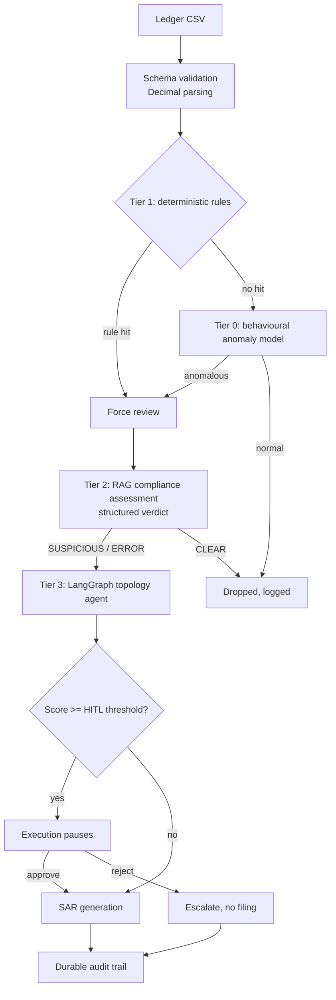

# Fintech Fraud Auditor

A tiered anti-money-laundering screening prototype. Cheap deterministic checks and
a behavioural anomaly model reduce a transaction ledger to the rows worth
spending an LLM call on, then a retrieval-grounded compliance tier and a stateful
graph agent assess what survives.

## The design decision that matters

The obvious way to build a cost funnel is to put the cheapest filter first and
drop everything it considers normal. That is what the first version of this
project did, and it was wrong in a way worth describing, because the same mistake
is easy to make in any tiered system.

An `IsolationForest` fitted on transaction amount discards anything whose amount
is statistically ordinary. Structuring — splitting a large sum into legs just
under the reporting threshold — is *defined* by amounts that look ordinary. The
optimisation designed to save money was deleting the fraud the later tiers
existed to catch, and a `$500` transfer from a sanctioned jurisdiction never
reached the country check because it had already been dropped on amount alone.

The fix is ordering, not tuning. Deterministic compliance rules run **before**
the statistical funnel and set a force-review flag the funnel is not permitted to
override. Cost optimisation never outranks a compliance rule.

Measured on `data/sample_ledger_labelled.csv` (450 rows, 30 labelled laundering
transactions across four typologies), via `python scripts/evaluate.py`. That
file is gitignored (generated, not checked in); run
`python scripts/generate_sample_ledger.py` first to reproduce it - the
generator uses a fixed seed, so a fresh clone gets byte-identical data and
these exact numbers:

| Pipeline | Recall | Precision | F1 | Forwarded to LLM |
|---|---|---|---|---|
| Original ordering | 10% | 33% | 0.15 | 9 rows (2%) |
| Current ordering | 100% | 68% | 0.81 | 44 rows (10%) |

Per typology, the original caught 0 of 10 structuring legs, 0 of 6 sanctioned
transfers, and 0 of 11 fan-in collections. It caught the circular-flow set only
because those transfers happened to exceed $10,000.

## Architecture



**Tier 1, deterministic rules** (`utils/rules.py`). Reporting threshold, the
structuring band below it, high-risk and secrecy jurisdictions, sanctions
screening, and unidentified counterparties. Runs first; a hit is binding.

**Tier 0, behavioural funnel** (`utils/funnel.py`, `utils/features.py`). Twelve
features describing how an account behaves across the batch — per-sender
velocity, transactions in the structuring band, counterparty fan-out and fan-in,
round-number ratio, corridor rarity — rather than the amount alone. The flag
threshold is a robust z-score against the batch's own median and MAD, so a clean
batch flags nothing. `contamination` is deliberately unused: it is a fixed quota
that flags 15% of a clean batch and drops 85% of a fraudulent one.

**Tier 2, compliance assessment** (`utils/agents.py`). Retrieval-grounded
analysis followed by an independent structured review. Verdicts come back through
a constrained schema, never by keyword-matching prose.

**Tier 3, topology** (`utils/graph_nodes.py`, `utils/graph_logic.py`). Circular
flows, account velocity, and beneficiary obfuscation. Scoring is per unique
counterparty and capped, so the result reflects network shape rather than how
many rows were uploaded.

**Human review.** LangGraph's `interrupt_before` suspends execution. Approval
records the officer, timestamp, decision, and note; rejection routes to
escalation and produces no filing.

## Requirements

Verified against **Python 3.14.4** on **Windows 11 (build 10.0.26200)**. On this
version, `SQLAlchemy` (a `langchain-community` dependency) has no prebuilt wheel
yet, so pip builds it from source on install; that needs no action from you, but
it does mean the first install is slower and briefly pulls build tooling.

## Setup

```bash
git clone <your-repo-url> && cd fintech-fraud-auditor
python -m venv .venv && source .venv/bin/activate   # Windows: .venv\Scripts\activate
pip install -r requirements.txt

cp .env.example .env       # then edit it
python scripts/generate_sample_ledger.py
streamlit run app.py
```

`requirements.txt` pins ranges wide enough to resolve (the tightly-coupled
`langchain`/`langgraph` cluster in particular needs room to find mutually
compatible versions). `requirements.lock.txt` is `pip freeze` output from a
known-working install and reproduces that exact set:

```bash
pip install -r requirements.lock.txt
```

Authentication uses Application Default Credentials. Run
`gcloud auth application-default login` locally, or Workload Identity in
production. Do not put a service-account key in the project root.

Index the regulatory corpus before using the compliance tier:

```bash
python scripts/ingest_pdf.py --file data/aml_guidelines.pdf
```

The app runs without the LLM backends: rules and the funnel still execute, and
the UI says so rather than presenting a blank result.

## Commands

```bash
pytest tests/ -v                        # 36 offline regression tests, no network

# data/sample_ledger*.csv are gitignored (generated, not checked in) - build
# them before evaluating. generate_sample_ledger.py uses a fixed seed (7), so
# this is deterministic: a fresh clone reproduces the labelled ledger byte-for-
# byte, which is what the recall/precision/F1 numbers above were measured on.
python scripts/generate_sample_ledger.py
python scripts/evaluate.py              # per-typology recall and precision
python scripts/evaluate.py --with-llm   # include the live compliance tier

python scripts/check_json.py --file data/transactions.json
python -m utils.chat_agent              # interactive corpus query
```

## What was fixed

| Area | Issue | Resolution |
|---|---|---|
| Funnel order | ML filter ran before compliance rules and discarded structuring | Rules first, with a binding force-review flag |
| Features | `IsolationForest` fitted on amount alone | Twelve behavioural features (`utils/features.py`) |
| Threshold | `contamination=0.15` flagged a fixed 15% regardless of data | Robust MAD z-score with a rate ceiling |
| Error handling | Exceptions returned a string that keyword-matched to CLEAR | `Verdict.ERROR`, never treated as cleared |
| Verdicts | Substring search matched "no indication of money laundering" | Constrained Pydantic schema |
| Risk score | `+50` per matching row, no dedup or cap; five rows scored 250 | Per unique counterparty, capped, clamped |
| Graph state | Nodes mutated checkpointed state in place | Copy before mutate |
| HITL | Approval node was `lambda state: state` | Records officer, timestamp, decision; rejection path added |
| Sessions | One global graph, thread IDs from transaction IDs | Session-scoped graph and namespaced threads |
| Singleton | Cached a half-built object when init failed | Assign only after success |
| Money | `float()` on `"$50,000"` raised | `Decimal` throughout, currency parser at the boundary |
| Input validation | Missing columns raised raw `KeyError` | Schema check with actionable messages |
| Prompt injection | Ledger fields interpolated into prompts | Scrubbing, fencing, and structured output |
| Secrets | `COPY . .` baked `.env` and `gcp-key.json` into the image | `.dockerignore`, ADC, no key in the build context |
| Container | Ran as root with build tools in the final layer | Multi-stage, non-root, healthcheck |
| Screening | Six hardcoded names, LLM-authored freeze directives | CSV watchlist with aliases, templated directives |
| Audit trail | Everything in session state, lost on refresh | SQLite append-only log with evidence hashes |
| Tests | Benchmarked a code path the app never ran | 36 offline tests plus a labelled evaluation set |
| Dependencies | `langchain-text-splitters` missing; 4 unused pins | Declared and pruned |

## Known limitations

This is a prototype and the following are real gaps, not oversights:

- **`MemorySaver` loses paused cases on restart.** For durable HITL pauses,
  install `langgraph-checkpoint-postgres` and pass it to
  `build_compliance_graph()`.
- **The bundled watchlist is a demo file.** Replace
  `data/sanctions_list.csv` with an OFAC SDN export. Name matching alone is not
  identity verification; confirm against date of birth and nationality.
- **Topology runs on the forwarded subset**, so hops the funnel dropped are not
  in the graph. Building the network from the full ledger is the next
  substantive change.
- **SQLite is single-node.** Move to Postgres with append-only enforcement at the
  database level before this is an audit record anyone should rely on.
- **Streamlit is synchronous.** Batches of a few thousand rows are fine; beyond
  that, move the LLM tier behind a queue.

## Roadmap

- Decoupled FastAPI backend with Celery for topology traversal
- Postgres checkpointer and audit log
- Full-ledger network construction for the topology tier
- Analyst feedback loop to tune thresholds against confirmed outcomes
