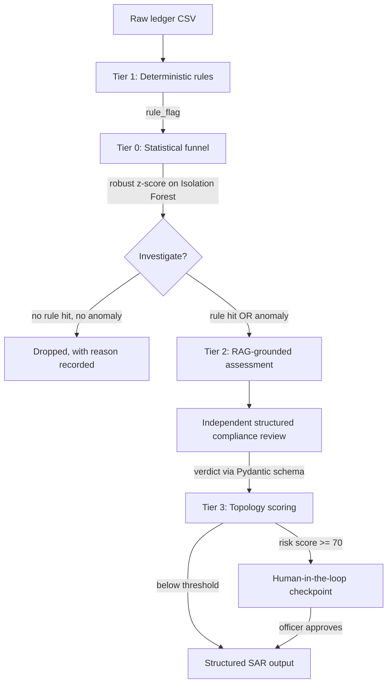

# Fintech Fraud Auditor: Tiered AML Detection Engine

A working prototype of a multi-tier Anti-Money Laundering pipeline. Cheap deterministic
and statistical tiers do the filtering; expensive LLM reasoning is spent only on the
rows that survive. Every forwarded transaction comes with a human-readable justification
for why it was forwarded.

The detection tiers run fully offline. Cloud LLM and vector-retrieval tiers are optional
and degrade gracefully when unconfigured.

<!-- TODO: embed the end-to-end audit GIF here, before anything else. -->
<!--  -->

## Results

Measured on `data/sample_ledger_labelled.csv` — 450 rows, 30 labelled laundering
transactions across four typologies — via `python scripts/evaluate.py`.

The ledger is generated, not checked in. `scripts/generate_sample_ledger.py` uses a
fixed seed (7) and produces byte-identical output, so a fresh clone reproduces these
numbers exactly:

| Pipeline | Recall | Precision | F1 | Forwarded to LLM |
|---|---|---|---|---|
| Rules + statistical funnel | 100% | 68% | 0.81 | 44 / 450 (10%) |

The asymmetry is deliberate. In AML, a false positive costs an analyst's time; a false
negative costs a missed filing and a regulatory finding. The funnel is tuned to keep
recall at 100% and accept the precision cost, which is why 90% of the batch is dropped
before any LLM call rather than 100% of it being sent.

## Why a transaction was forwarded

Every flagged row carries its reasons. Three real examples from the sample ledger:

```
CIR-002    amount 24,702.86    Seychelles    rule + statistical anomaly
  - Value 24,702.86 is at or above the 10,000 reporting threshold.
  - Counterparty jurisdiction 'Seychelles' is a recognised secrecy jurisdiction.
  - Behavioural model flagged this row (anomaly score -0.235, more than 2.5
    robust deviations below the batch median).

FAN-008    amount 4,302.01     USA           statistical anomaly
  - Behavioural model flagged this row (anomaly score -0.158, more than 2.5
    robust deviations below the batch median).

TXN-00295  amount 11,807.58    Australia     deterministic rule
  - Value 11,807.58 is at or above the 10,000 reporting threshold.
```

A score alone is not defensible to a compliance officer. A reason is.

## Architecture

Deterministic rules are evaluated first and have right of way: the statistical funnel
can add rows to the review set, but can never remove a row a rule flagged. Cost
optimisation does not outrank a compliance rule.



**Tier 1 — Deterministic rules.** Reporting-threshold breaches, sanctioned and secrecy
jurisdictions, placeholder counterparties. Currency handled as `Decimal` throughout,
never float. Thresholds live in `config.py` and are environment-overridable, so a policy
change is a config edit rather than a code change.

**Tier 0 — Statistical funnel.** Unsupervised Isolation Forest over twelve behavioural
features (`utils/features.py`), scored with a robust z-score against the batch's own
median and MAD.

**Tier 2 — Grounded assessment plus independent review.** A retrieval-grounded first
pass against a regulatory corpus in Qdrant, followed by a separate compliance review
that does not trust the first pass's prose. Verdicts return through a constrained
Pydantic schema. Any failure returns an explicit `ERROR` verdict, never a silent
`CLEAR`.

**Tier 3 — Topology scoring.** Circular flow, obfuscation, and missing-data signals
accumulate into a risk score. Above `HITL_REVIEW_THRESHOLD` (default 70), execution
pauses for human authorisation before a SAR is produced.

**Sanctions screening** uses deterministic fuzzy matching (RapidFuzz, Levenshtein
distance, default match threshold 88) rather than LLM prompting. Watchlist screening is
a compliance directive, not a judgement call, and it must not be exposed to
hallucination.

## Design decisions worth explaining

**The anomaly model is never persisted, by design.** `run_funnel()` refits a fresh
Isolation Forest on every batch. The twelve features are batch-relative —
`sender_distinct_receivers`, `country_rarity`, `receiver_fan_in` — and the flag
threshold is a robust z-score against that batch's own median and MAD. A model fitted on
one ledger and reused on another would be scoring against the wrong population. The
consequence, stated plainly: the same transaction can be flagged in one batch and
cleared in another depending on what it is batched with. That is defensible for batch
audit work and disqualifying for real-time screening.

**`contamination` is not used.** A fixed contamination rate is a quota: it flags 15% of a
clean batch and drops 85% of a batch that is 90% fraudulent. The flagged count should
follow the data, so the funnel thresholds on the decision function instead.
`MAX_ML_FLAG_RATE` exists as a ceiling only — it can remove flags to protect the LLM
budget on a pathological batch, never add them.

**Median and MAD rather than mean and standard deviation.** A handful of extreme outliers
would otherwise drag the threshold out to meet them. A batch with no dispersion has no
outliers by definition and flags nothing.

**Verdicts come back through a schema, not a substring search.** An earlier build
keyword-matched the reviewer's text for "suspicious", "laundering", and "flag". The
reviewer's job is finding false positives, so it routinely writes "no indication of money
laundering" — which matched.

**Failures fail closed.** An earlier build caught every exception and returned an error
string, which the caller then keyword-matched, found no risk words in, and recorded as
CLEAR. A provider timeout produced a clean audit run. Failures now return
`Verdict.ERROR`, which is never treated as cleared anywhere in the codebase.

**Terminal errors are not retried.** Bad credentials, a malformed request, or a
nonexistent model fail immediately rather than consuming three attempts and several
seconds of backoff on an error that will not change.

**Re-ingestion updates rather than duplicates.** Vector point IDs are a deterministic
uuid5 of the chunk text, so re-running ingestion on the same corpus is idempotent.

## Setup

Verified on Python <!-- TODO: fill in the version you standardised on --> and Windows.

```bash
git clone https://github.com/<your-username>/<your-repo>.git
cd <your-repo>
python -m venv .venv
.venv\Scripts\activate        # macOS/Linux: source .venv/bin/activate
pip install -r requirements.txt
```

`requirements.txt` carries compatible version ranges so pip can resolve.
`requirements.lock.txt` carries the exact verified versions — install from that if you
want to reproduce the tested environment precisely.

Run the offline pipeline:

```bash
python scripts/generate_sample_ledger.py   # seeded, deterministic
pytest tests/ -v                           # 36 regression tests, no network
python scripts/evaluate.py                 # per-typology recall and precision
streamlit run app.py
```

That is the whole detection pipeline. No credentials, no cloud account, no cost.

### Optional: retrieval and LLM tiers

Copy `.env.example` to `.env`. With `QDRANT_URL` unset, the compliance tier reports
itself unavailable and the rest of the app runs normally.

For local retrieval:

```bash
docker run -p 6333:6333 -v "$(pwd)/qdrant_storage:/qdrant/storage" qdrant/qdrant
python scripts/ingest_pdf.py --file data/<your-corpus>.pdf
```

The regulatory corpus is not distributed with this repository. Use public-domain
sources — the FFIEC BSA/AML Examination Manual, FinCEN advisories, OFAC program
summaries.

LLM provider is selected with `MODEL_PROVIDER`: `bedrock` (AWS, Claude Haiku via a
cross-region inference profile) or `vertex` (GCP, Gemini Flash). The model must support
tool use, since verdicts come back through structured output. Switching providers
changes the embedding dimension, so re-ingest into a fresh collection.

See `SETUP.md` and `SETUP_AWS.md` for detail.

## What this is not

This is a prototype demonstrating detection logic and explainability, not a deployable
compliance system. Before anything resembling production use it would need model
validation and documentation under SR 11-7, immutable per-decision audit trails, data
lineage and retention policy, access control and segregation of duties, change
management, backtesting and periodic revalidation, and drift monitoring with alerting.

The synthetic ledger is generated by a script that knows the typologies it is planting.
Performance on it is evidence the pipeline works as designed, not evidence of real-world
detection rates.

## Roadmap

- **Decoupled backend** — move synchronous Streamlit logic behind an async FastAPI service.
- **Queued execution** — Celery/Redis for topology traversal, so large batches do not block.
- **Durable state** — replace the in-memory LangGraph checkpointer with PostgreSQL for HITL pauses that survive a restart.
- **Local-first providers** — an offline embedding and LLM path so the full pipeline runs with no cloud account.
- **Per-row feature attribution** — surface which of the twelve features drove each individual flag, not just which separate the flagged set.

## Stack

Python, pandas, scikit-learn, Pydantic, RapidFuzz, LangChain, LangGraph, Qdrant,
Streamlit. AWS Bedrock or Google Vertex AI for inference.

## Layout

```
app.py                      Streamlit UI
config.py                   thresholds, model settings, paths
utils/
  rules.py                  Tier 1 deterministic rules
  features.py               twelve behavioural features
  funnel.py                 Tier 0 funnel and per-row explanations
  agents.py                 Tier 2 assessment and compliance review
  graph_logic.py            Tier 3 topology and HITL orchestration
  screening.py              fuzzy sanctions matching
  schemas.py, verdicts.py   structured output contracts
  sanitize.py               evidence construction, injection handling
  audit_log.py              decision provenance
scripts/
  generate_sample_ledger.py seeded synthetic data
  evaluate.py               recall/precision by typology
  ingest_pdf.py             corpus ingestion into Qdrant
  preflight.py              environment and credential checks
tests/                      36 offline regression tests
```

<!-- TODO: add a LICENSE file and reference it here. -->
